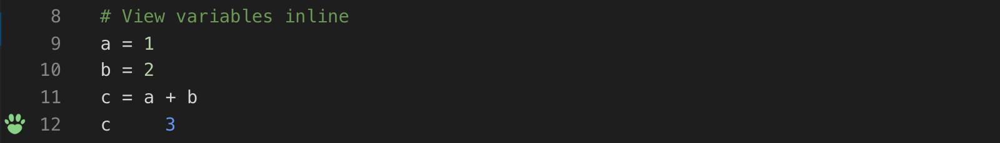
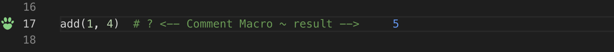
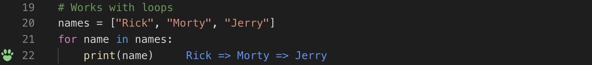
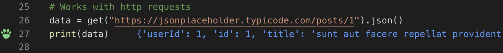
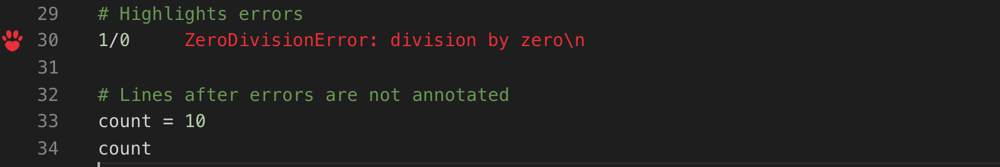

# Fox - Rapid Prototyping Playground for Python

Fox is a VsCode extension that runs your code on save and displays various execution results in your code editor.

It was inspired by [`Quokka.js:`](https://quokkajs.com/) `The Rapid Prototyping Playground for JavaScript and TypeScript`.

### View variables inline

---
### Works with print

---
### Comment Macro

---
### Works with loops

---
### Works with http requests

---
### Highlights errors

---
### Lines after errors are not annotated

---
## License

Fox source is available under the Apache 2.0 Software license.
Any dependant libraries are subject to their own licenses and
terms, the most direct of which are listed below.

## Third Party Libraries

[Hunter](https://github.com/ionelmc/python-hunter) - Hunter is a flexible code tracing toolkit. - [BSD License](https://github.com/ionelmc/python-hunter/blob/master/LICENSE)
